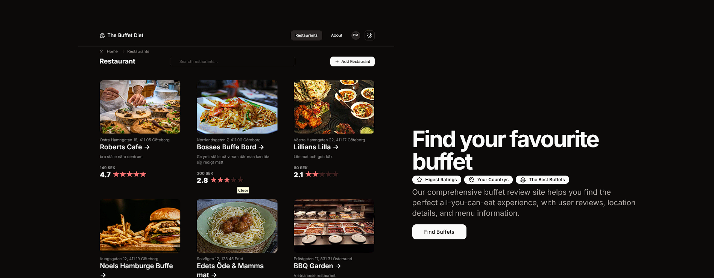
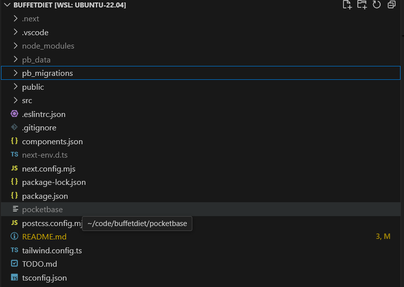

# The Buffet Diet - Website

The buffet diet is a website that allows you to find buffets and all you can eat places in your area.

[](https://buffetdiet.com)

## Technologies Used


## 🔑Key Features

- 🔎 **Find Buffets**: Find All you can eat places nearby you.
- ⭐ **Community curated buffet reviews**: The buffets are reviewed and tested by the community.
- 🍔 **Opinionated Restaurant Details**: No matter what diet you follow or dietary restrictions, here you can find a all you can eat for you. View restaurant details, including reviews, ratings, and macronutrient content.

## Getting development Started

Install dependencies

```bash
npm install
```

### First, run the development server

```bash
npm run dev
# or
yarn dev
# or
pnpm dev
# or
bun dev
```

Open [http://localhost:3000](http://localhost:3000) with your browser to see the result.

### To run pocketbase database locally

```bash
# To start the pocketbase server locally

./pocketbase serve 

# You might have to run if you use Ubuntu: sudo ./pocketbase serve 

#├─ REST API: http://127.0.0.1:8090/api/
#└─ Admin UI: http://127.0.0.1:8090/_/
```

### To setup pocketbase database on your machine

1. Navigate to [https://pocketbase.io/docs](Pocketbase Docs) and follow the instructions to install pocketbase on your machine.
2. Download the executable
3. Place executable in project root:

4. Run the executable `./pocketbase serve` in the root folder.
